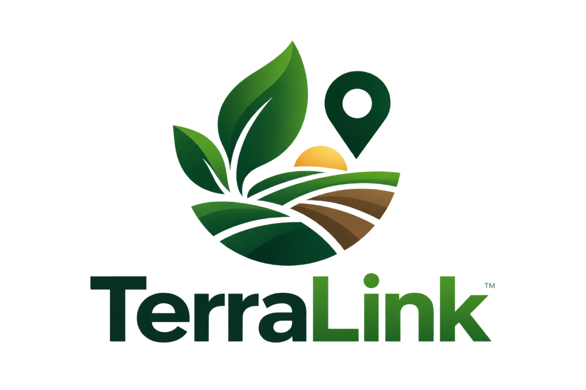

<p align="center">
  
</p>

# TerraLink — National Land Acquisition Command Center

An enterprise-grade, clean and minimal national land acquisition and management command center built with **Next.js 15 (App Router)**, **TypeScript**, and **Vanilla CSS**. Designed for statutory compliance under the RFCTLARR Act 2013, ULPIN cadastral intelligence, and PFMS financial disbursements.

## Features

- **Executive Command Center**: Real-time visibility into capital infrastructure projects across state corridors.
- **RFCTLARR 2013 Statutory Pipeline**: End-to-end milestone tracker from Section 4(1) Proposal to Section 38 Possession and R&R Award.
- **Cadastral GIS & ULPIN Intelligence**: Interactive SVG vector GIS viewer with cadastral boundary layers, Right-of-Way (RoW) buffers, disputed parcel isolation, and coordinate readouts.
- **MIS Project Registry & CSV Export**: Searchable and sortable registry with instant one-click CSV export of national project dossiers.
- **Statutory SLA & Delay-Risk Engine**: Algorithmic delay prediction and statutory timeline tracking.
- **Immutable Audit Trail**: Chronological event ledger recording administrative actions, valuations, and possession certifications.
- **Role-Based Access Control (RBAC)**: Scoped officer profiles for Ministry, State, District, PIA, and Field Officers.

## Quick Start

### 1. Install Dependencies

```bash
npm install
```

### 2. Run Locally

```bash
npm run dev
```

Open `http://localhost:3000`.

The default demo token is:
```env
NEXT_PUBLIC_DEMO_TOKEN=terralink-demo-token-2026
```

## Deploying to Vercel

This repository is pre-configured for seamless zero-config deployment on [Vercel](https://vercel.com):

1. Push your repository to GitHub / GitLab / Bitbucket.
2. Import the project into your Vercel Dashboard.
3. Framework preset will automatically detect **Next.js**.
4. (Optional) Set environment variable `NEXT_PUBLIC_DEMO_TOKEN` in Vercel project settings.
5. Deploy! Both `npm run lint` and `npm run build` pass cleanly with zero warnings or errors.

## Firebase Integration (Optional)

TerraLink includes Firestore client bindings in `lib/firebase/client.ts` and `lib/firebase/projects.ts`. If environment variables are omitted, TerraLink gracefully falls back to deterministic seed data so the command center functions immediately.

To connect your live Firebase project, set:
```env
NEXT_PUBLIC_FIREBASE_API_KEY=your_api_key
NEXT_PUBLIC_FIREBASE_AUTH_DOMAIN=your_project.firebaseapp.com
NEXT_PUBLIC_FIREBASE_PROJECT_ID=your_project_id
NEXT_PUBLIC_FIREBASE_STORAGE_BUCKET=your_project.appspot.com
NEXT_PUBLIC_FIREBASE_MESSAGING_SENDER_ID=your_sender_id
NEXT_PUBLIC_FIREBASE_APP_ID=your_app_id
```
